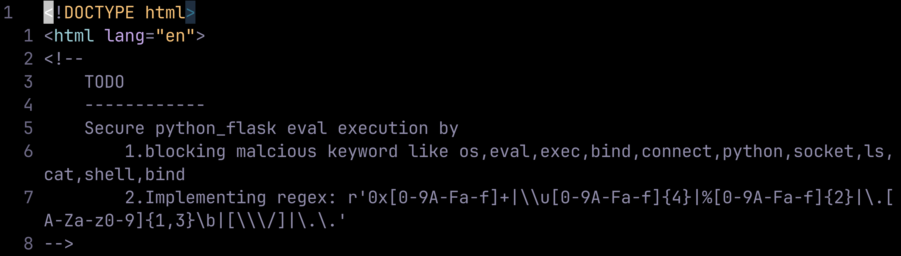
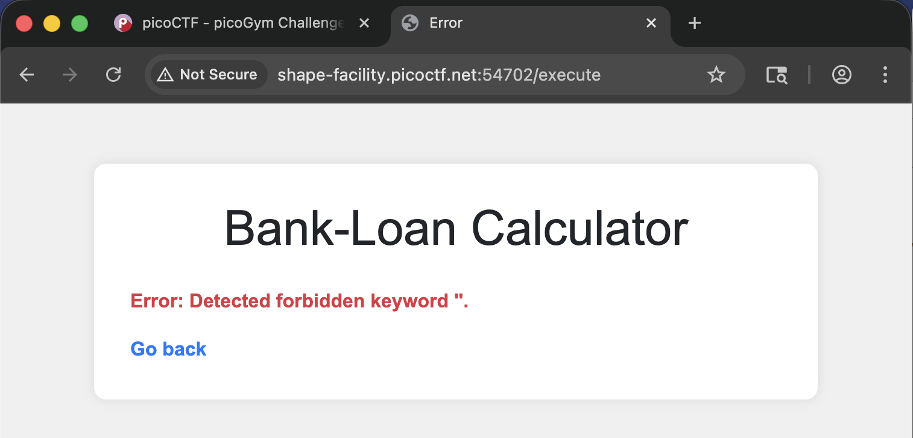
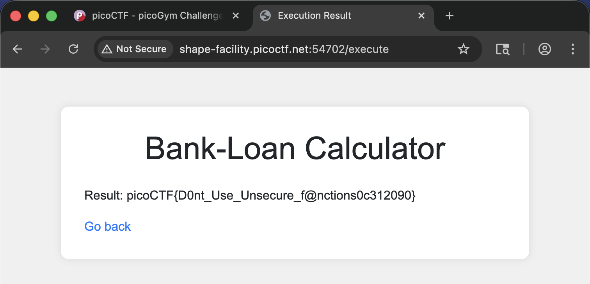

## Write-Up

author: yal212

### Challenge Description

ABC Bank's website has a loan calculator to help its clients calculate the amount they pay if they take a loan from the bank. 
Unfortunately, they are using an `eval` function to calculate the loan. 
Bypassing this will give you Remote Code Execution (RCE). 
Can you exploit the bank's calculator and read the flag?

### Inspection

```hints
Bypass regex
```

```hints
The flag file is `/flag.txt`
```

From the hints, we can know we want to somehow read the contents in ***/flag.txt***.

From ***index.html*** we can also see that the website is trying to secure the ***eval*** function by do these actions:



Not only do we know that the ***eval*** function is from ***python_flask***, we also know what the filter is blocking.

### Exploiting

We can try this first as we expect it to be blocked:

```python
open('flag.txt')
```



Now we need to try and bypass the filter:

```python
open(chr(47)+"flag"+"."+"txt").read()
```



### Result

Flag:

> picoCTF{D0nt_Use_Unsecure_f@nctions0c312090}
