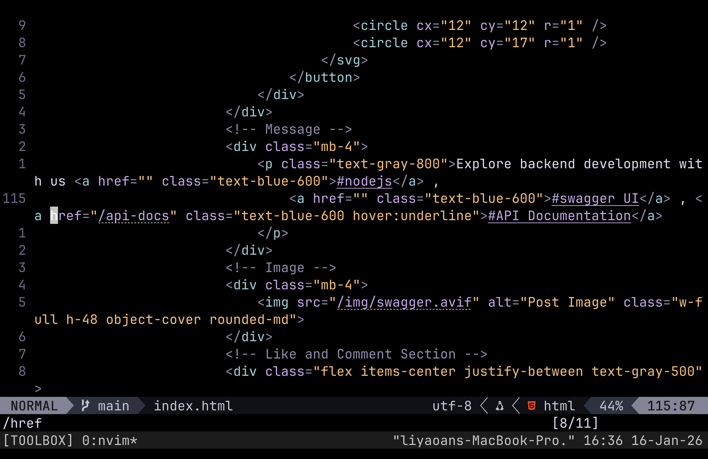
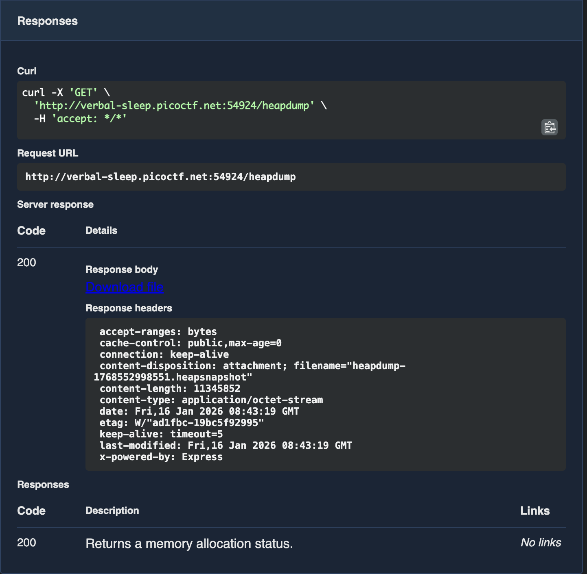
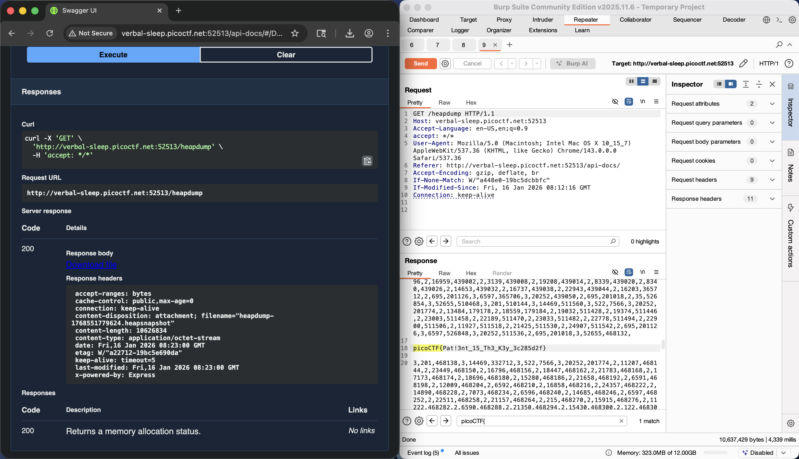

## Write-Up

author: yal212

### Challenge Description

Welcome to the challenge! In this challenge, you will explore a web application and find an endpoint that exposes a file containing a hidden flag.
The application is a simple blog website where you can read articles about various topics, including an article about API Documentation. Your goal is to explore the application and find the endpoint that generates files holding the server’s memory, where a secret flag is hidden.
Additional details will be available after launching your challenge instance.

### Inspection

From the problem description we can tell that the vulnerability is probably something to do with an article about ***API Documentation***.

However, on the website there isn't anything about ***API Documentation*** except a few tags.

We can first inspect the *index.html* file, and we will find except **/about**, **/services** and some tags, the **/api-docs** wasn't visible from **/**.

By going to **/api-docs** page, we will see a bunch of cool stuff about ***api endpoints***.
One thing that really stands out is the ***/heapdump*** under **Diagnosing**.

Execute it and you will find the flag.

### Result

This is what you'll see after executing.

Can't find flag from here, so try another method.

I use **Burp Suite** for this, send http request to target then search for flag in the result and we can see the flag.

Flag: 

> picoCTF{Pat!3nt_15_Th3_K3y_3c285d2f}
